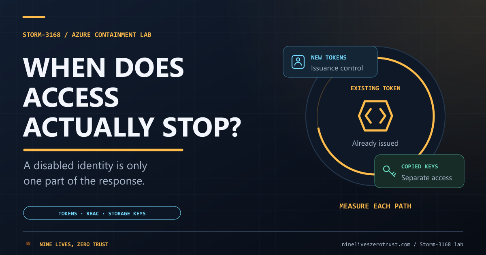
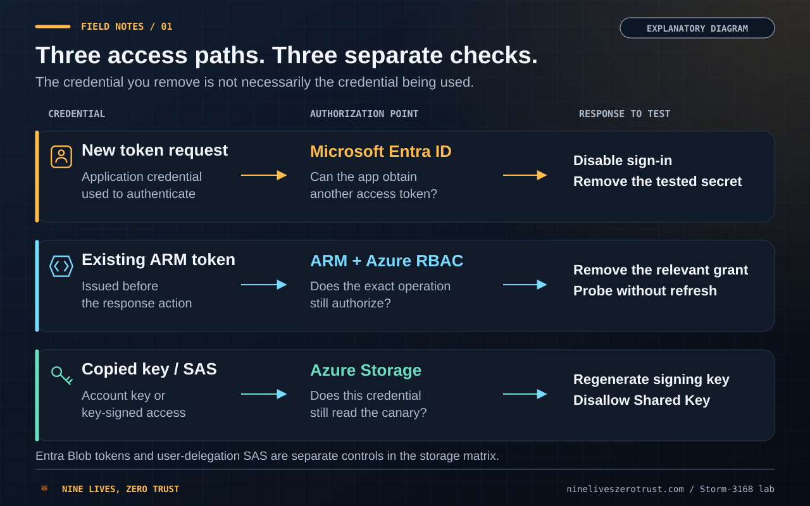
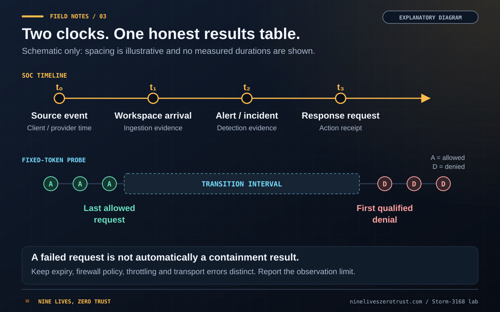
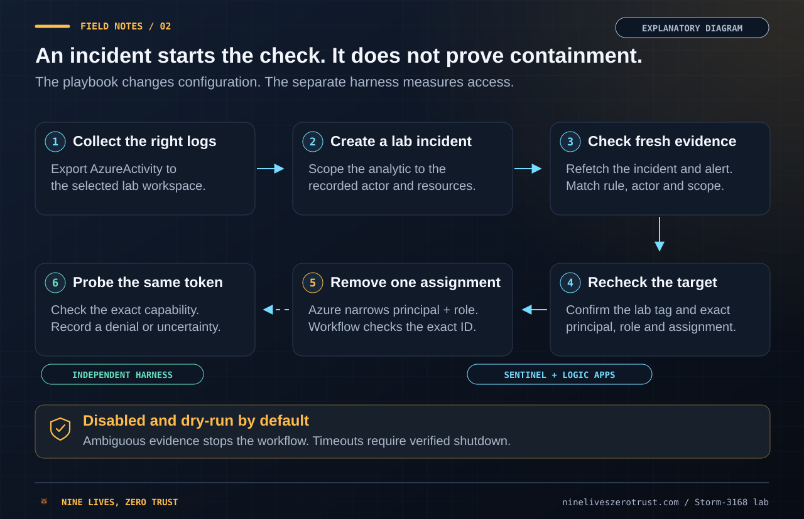
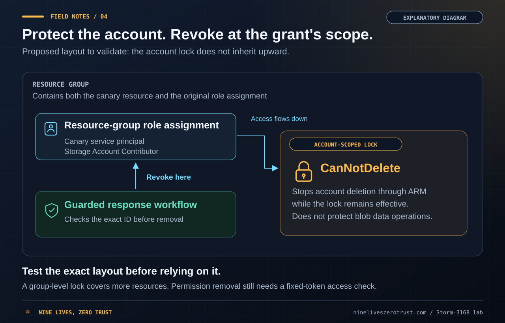

> **Draft under review.** The repeated containment study is not complete. Microsoft-documented expectations and pending lab results are shown separately below.

<figure class="media-panel media-panel--hero">
  
</figure>

Disabling a compromised service principal feels like the end of a response. The portal confirms the change, the playbook finishes, and the incident can look contained.

That conclusion needs a resource request behind it. An access token issued earlier, a copied storage key and a key-signed SAS do not all depend on the same authorization decision. A configuration change can close one route while another remains available.

This lab follows a narrower question: **after one response action, which exact request stops working, when do we observe that change, and what still works?** Microsoft Sentinel supplies the detection and orchestration context. A separate harness supplies the access evidence.

## The results table comes first

The final article will lead with observed intervals and remaining access. The table shows what each test will report. Each configuration needs three independent valid trials with a working baseline; repeated HTTP requests inside one trial do not count as additional trials.

<div class="mobile-table-wrap">
  <table class="mobile-card-table" aria-label="Containment experiments: documented expectations and pending results">
    <thead><tr><th scope="col">Experiment</th><th scope="col">Credential or evidence path</th><th scope="col">Microsoft documents (expectation, not a result)</th><th scope="col">Valid trials</th><th scope="col">Access-loss interval</th><th scope="col">What still worked</th></tr></thead>
    <tbody>
      <tr>
        <td data-label="Experiment">Visibility baseline</td>
        <td data-label="Credential or evidence path">Actor writes and ListKeys; provider logs</td>
        <td data-label="Microsoft documents (expectation, not a result)"><a href="https://learn.microsoft.com/en-us/azure/azure-monitor/fundamentals/activity-log">Activity Log: usually 3-20 minutes</a> before analysis and alerting.</td>
        <td data-label="Valid trials">0 / 3</td>
        <td data-label="Access-loss interval">Not applicable: measures event, ingestion and alert times</td>
        <td data-label="What still worked">Not applicable</td>
      </tr>
      <tr>
        <td data-label="Experiment">Remove direct writer grant</td>
        <td data-label="Credential or evidence path">Fixed ARM token</td>
        <td data-label="Microsoft documents (expectation, not a result)"><a href="https://learn.microsoft.com/en-us/azure/role-based-access-control/troubleshooting#symptom---role-assignment-changes-are-not-being-detected">RBAC: up to 10 minutes</a> for role-assignment changes.</td>
        <td data-label="Valid trials">0 / 3</td>
        <td data-label="Access-loss interval">Pending</td>
        <td data-label="What still worked">Pending</td>
      </tr>
      <tr>
        <td data-label="Experiment">Remove group writer grant</td>
        <td data-label="Credential or evidence path">Fixed ARM token</td>
        <td data-label="Microsoft documents (expectation, not a result)"><a href="https://learn.microsoft.com/en-us/azure/role-based-access-control/troubleshooting#symptom---role-assignment-changes-are-not-being-detected">RBAC: up to 10 minutes</a> for role-assignment changes.</td>
        <td data-label="Valid trials">0 / 3</td>
        <td data-label="Access-loss interval">Pending</td>
        <td data-label="What still worked">Pending</td>
      </tr>
      <tr>
        <td data-label="Experiment">Remove group membership</td>
        <td data-label="Credential or evidence path">Fixed ARM token</td>
        <td data-label="Microsoft documents (expectation, not a result)">No timing bound identified for this application service-principal group path; measure it separately.</td>
        <td data-label="Valid trials">0 / 3</td>
        <td data-label="Access-loss interval">Pending</td>
        <td data-label="What still worked">Pending</td>
      </tr>
      <tr>
        <td data-label="Experiment">Disable service-principal sign-in</td>
        <td data-label="Credential or evidence path">Fixed ARM token; separate issuance check</td>
        <td data-label="Microsoft documents (expectation, not a result)">New issuance should be blocked. No ARM cutoff established by CAE: <a href="https://learn.microsoft.com/en-us/entra/identity/conditional-access/concept-continuous-access-evaluation-workload">CAE covers Graph only</a>.</td>
        <td data-label="Valid trials">0 / 3</td>
        <td data-label="Access-loss interval">Pending</td>
        <td data-label="What still worked">Pending</td>
      </tr>
      <tr>
        <td data-label="Experiment">Remove the tested application secret</td>
        <td data-label="Credential or evidence path">Fixed ARM token; separate issuance check</td>
        <td data-label="Microsoft documents (expectation, not a result)">New issuance using that secret should fail. Removing a secret does not establish rejection of the fixed token.</td>
        <td data-label="Valid trials">0 / 3</td>
        <td data-label="Access-loss interval">Pending</td>
        <td data-label="What still worked">Pending</td>
      </tr>
      <tr>
        <td data-label="Experiment">Regenerate key1 and key2 in separate runs</td>
        <td data-label="Credential or evidence path">Copied keys and their SAS controls</td>
        <td data-label="Microsoft documents (expectation, not a result)"><a href="https://learn.microsoft.com/en-us/azure/storage/common/storage-account-keys-manage">Key rotation</a> invalidates that key and account/service SAS signed with it; the other key and user delegation SAS are unaffected.</td>
        <td data-label="Valid trials">0 / 6</td>
        <td data-label="Access-loss interval">Pending</td>
        <td data-label="What still worked">Pending</td>
      </tr>
      <tr>
        <td data-label="Experiment">Disallow Shared Key</td>
        <td data-label="Credential or evidence path">Key/SAS matrix; Entra control</td>
        <td data-label="Microsoft documents (expectation, not a result)"><a href="https://learn.microsoft.com/en-us/azure/storage/common/shared-key-authorization-prevent">Shared Key control</a>: key-authorized requests and account/service SAS are rejected. Entra and user delegation SAS are permitted, subject to their own access checks.</td>
        <td data-label="Valid trials">0 / 3</td>
        <td data-label="Access-loss interval">Pending</td>
        <td data-label="What still worked">Pending</td>
      </tr>
      <tr>
        <td data-label="Experiment">Execute the guarded response manually</td>
        <td data-label="Credential or evidence path">Exact role removal; independent probe</td>
        <td data-label="Microsoft documents (expectation, not a result)"><a href="https://learn.microsoft.com/en-us/azure/role-based-access-control/troubleshooting#symptom---role-assignment-changes-are-not-being-detected">RBAC: up to 10 minutes</a>; a completed workflow is not evidence of denied access.</td>
        <td data-label="Valid trials">0 / 3</td>
        <td data-label="Access-loss interval">Pending</td>
        <td data-label="What still worked">Pending</td>
      </tr>
      <tr>
        <td data-label="Experiment">Deliver a native Sentinel incident</td>
        <td data-label="Credential or evidence path">Dispatcher dry run and event timing</td>
        <td data-label="Microsoft documents (expectation, not a result)"><a href="https://learn.microsoft.com/en-us/azure/sentinel/scheduled-rules-overview">Scheduled rules: 5-minute delay</a> from their scheduled time, in addition to source availability and processing.</td>
        <td data-label="Valid trials">0 / 3</td>
        <td data-label="Access-loss interval">Not applicable: measures event, ingestion and alert times</td>
        <td data-label="What still worked">Not applicable</td>
      </tr>
      <tr>
        <td data-label="Experiment">Apply a ReadOnly account lock</td>
        <td data-label="Credential or evidence path">Fixed ARM token requesting ListKeys</td>
        <td data-label="Microsoft documents (expectation, not a result)">A <a href="https://learn.microsoft.com/en-us/azure/azure-resource-manager/management/lock-resources">ReadOnly lock</a> blocks the ListKeys operation; copied keys need separate controls.</td>
        <td data-label="Valid trials">0 / 3</td>
        <td data-label="Access-loss interval">Pending</td>
        <td data-label="What still worked">Pending</td>
      </tr>
      <tr>
        <td data-label="Experiment">Disable sign-in for a Blob-token test</td>
        <td data-label="Credential or evidence path">Fixed Entra Blob token</td>
        <td data-label="Microsoft documents (expectation, not a result)">New issuance should be blocked. <a href="https://learn.microsoft.com/en-us/entra/identity/conditional-access/concept-continuous-access-evaluation-workload">CAE covers Graph only</a>; observe this token through its recorded expiry.</td>
        <td data-label="Valid trials">0 / 3</td>
        <td data-label="Access-loss interval">Pending</td>
        <td data-label="What still worked">Pending</td>
      </tr>
    </tbody>
  </table>
</div>

Access-token lifetimes are normally variable, often 60-90 minutes; client, resource and policy can change them. The expiry tests use the fixed token's recorded `exp`, not an assumed 90-minute cutoff. [Token lifetimes](https://learn.microsoft.com/en-us/entra/identity-platform/configurable-token-lifetimes)

That is 12 core cases, 13 action configurations and 39 minimum independent trials. The larger matrix remains an extension, including application deactivation, destructive prevention tests and recovery. It is not the minimum scope for this article.

One earlier no-action control did complete: three ARM reads before and three after the control point, using the same token. Four earlier pilot attempts were incomplete. Those receipts, the synthetic KQL replay and the responder dry run are implementation checks; none fills a revocation row in this table. The [verification record](verification-status.md) keeps those distinctions visible.

## Why Storm-3168 is the right incident to examine

Microsoft's September 25 report describes June 2026 activity involving two compromised Azure service principals. More than 100 storage-account deletion attempts took place in roughly seven minutes. Most targeted accounts were deleted; locks and deletion protection saved a few. Storage Account Contributor permissions inherited through a group authorized those storage deletions. That detail is why this lab tests group-granted access separately. Later successful ListKeys requests created another potential route to data.

The 90 minutes is not a warning-to-wipe interval: it separates the identities' first enumeration. The destructive phase followed about 16 hours after the second identity's initial burst. Microsoft also found a secret exposed in a public GitHub issue, but could not confirm it was used. The report did not observe a ransom note or confirm exfiltration. The operation timing indicates automation or scripting; it does not let this lab establish the attacker's use of AI. [Microsoft's investigation](https://www.microsoft.com/en-us/security/blog/2026/09/25/storm-3168-agentic-driven-cloud-attacks-using-compromised-service-principals/)

The useful response lesson is about authority. We need to account for the principal's current permissions and credentials already obtained through those permissions.

## Separate the three access paths

<figure class="media-panel media-panel--diagram">
  <a href="visuals/credential-paths.svg" target="_blank" rel="noopener" aria-label="Open full-size diagram: Three access paths: Entra ID checks new token requests, Azure RBAC checks a fixed ARM token reused without refresh, and Azure Storage checks copied keys and key-signed SAS. The token tests compare grant removal, sign-in disablement and secret removal.">
    
  </a>
  <figcaption>Explanatory model. These are separate test channels, not measured response outcomes. Select the diagram to open it full size.</figcaption>
</figure>

**New token issuance** is an authentication question. Can the application use the tested credential to obtain another token? Disabling sign-in or removing that credential targets this route. Application-level deactivation and tenant-local service-principal disablement are distinct operations. [Application deactivation](https://learn.microsoft.com/en-us/entra/identity/enterprise-apps/deactivate-app-registration)

**An existing ARM token** is a resource-authorization question. The experiment retains one token and repeatedly requests the same bounded operation. Workload-identity continuous access evaluation currently supports Microsoft Graph as the resource provider; it should not be assumed to revoke ARM access the same way. [CAE scope](https://learn.microsoft.com/en-us/entra/identity/conditional-access/concept-continuous-access-evaluation-workload)

**A copied storage credential** is a third route. Regenerating one account key affects that key and SAS signed with it. User-delegation SAS is not revoked by account-key rotation. Disallowing Shared Key rejects key-authorized requests, service SAS and account SAS. It permits user delegation SAS and Entra-authorized requests subject to their own permissions and network checks. The matrix keeps those controls separate. [Key rotation](https://learn.microsoft.com/en-us/azure/storage/common/storage-account-keys-manage), [Shared Key authorization](https://learn.microsoft.com/en-us/azure/storage/common/shared-key-authorization-prevent)

A disabled principal with no remaining secrets is therefore not, by itself, evidence that every previously issued credential is unusable.

## Establish visibility before enabling a response

The first check is mundane and essential: does the selected workspace receive the intended source?

Creating a Sentinel workspace does not establish an Activity Log export. The lab needs an explicit route from the subscription, while preserving any existing destination. Service-principal sign-ins can be read from a separately selected authorized workspace. The collector records that choice rather than pretending both sources live in one place.

Azure Activity Log generally omits ordinary reads. Authentication logs also do not describe every operation performed with a token. We cannot recreate Microsoft's entire investigative view merely by enabling a connector. [Azure Activity Log](https://learn.microsoft.com/en-us/azure/azure-monitor/fundamentals/activity-log)

This small query is a visibility check, not a threat-actor detector. Replace the placeholders only in a private copy:

```kusto
let LabGroup = tolower("/subscriptions/<subscription>/resourceGroups/<lab>");
AzureActivity
| where TimeGenerated > ago(1h)
| extend NormalizedId = tolower(ResourceId)
| where NormalizedId == LabGroup
    or NormalizedId startswith strcat(LabGroup, "/")
| project EventTime = TimeGenerated,
          SubmittedAt = EventSubmissionTimestamp,
          ArrivedAt = ingestion_time(),
          OperationNameValue, ActivityStatusValue, ResourceId
| order by EventTime asc
```

An unavailable table needs source, ingestion and access checks; a diagnostic table may await its first data. An empty result means the query returned no rows in that window. Neither is proof that the principal lacked access. [Diagnostic settings](https://learn.microsoft.com/en-us/azure/azure-monitor/data-collection/diagnostic-settings)

Rule speed also starts after the source becomes available. Microsoft documents a two-minute delay for NRT rules versus five minutes for scheduled rules; NRT uses ingestion time. That does not remove the Activity Log's source delay. This lab currently supplies a scheduled rule, so its timing must be measured as deployed. [NRT behavior](https://learn.microsoft.com/en-us/azure/sentinel/near-real-time-rules), [scheduled-rule timing](https://learn.microsoft.com/en-us/azure/sentinel/scheduled-rules-overview)

## Measure two clocks

<figure class="media-panel media-panel--diagram">
  <a href="visuals/measurement-clocks.svg" target="_blank" rel="noopener" aria-label="Open full-size diagram: Two clocks: detection runs from the source event to response request t3; access probes the fixed token from a baseline through the response to the last allowed request, first qualified denial, or observation limit.">
    
  </a>
  <figcaption>Timing model only. The positions and intervals are illustrative; no experiment durations are shown. Select the diagram to open it full size.</figcaption>
</figure>

The client records when it sends the tested request and receives the response. The telemetry collector records provider event time, submission time, workspace ingestion, and alert or incident processing evidence where available. The action receipt records the actual response request and its acknowledgment.

These timestamps answer different questions. Detection delay measures when the SOC could act. The fixed-token probe measures whether the selected operation still worked. A completed Logic App run belongs to neither category until its meaning is checked.

Polling produces an interval between the last allowed request and the first qualified denial. If the first post-action probe is denied, the earlier baseline still matters. If the token later expires, that expiry must not erase a denial interval already observed. If the observation ends with access still allowed, report that limit instead of inventing a revocation time.

The window should fit the experiment. Token-bound actions need observation through the fixed token's recorded expiry; shorter or capped runs must report their limit. Microsoft says role-assignment changes can take up to 10 minutes to take effect because Azure Resource Manager caches them. The fixed-token tests measure that behavior without forcing a token refresh. [RBAC propagation](https://learn.microsoft.com/en-us/azure/role-based-access-control/troubleshooting)

## Hold the token still

The harness acquires a probe token before the action and sends it through direct HTTP calls. The probe path does not refresh it or follow redirects. A separate operator identity performs the response.

An optional new-token check is a separate channel. Its result is recorded and any returned token is discarded; it never replaces the fixed token. The trial receipt binds the baseline, action and post-action files to one credential label and capability. It also records the exact role assignment, principal and scope for removal experiments.

Direct role removal, deleting a group's role assignment and removing one group membership are different tests. The writer-removal scenario retains a separate Reader grant so the write probe can inspect the canary without preserving write authority. The result must describe that capability, not claim the identity lost every permission.

Errors need the same care. Expiry, a transport failure, throttling and a firewall policy block are separate observations. An ambiguous storage authorization error cannot become a containment result just because it returned HTTP 403. A rotated key's rejection also needs its own credential context and healthy control.

## Build the Sentinel playbook around a fixed target

<figure class="media-panel media-panel--diagram">
  <a href="visuals/guarded-playbook.svg" target="_blank" rel="noopener" aria-label="Open full-size diagram: A six-step guarded Sentinel flow ends with an independent fixed-token capability check">
    
  </a>
  <figcaption>Proposed response flow. The actor's token stays in the harness, outside the Logic App. Native incident delivery still needs live validation. Select the diagram to open it full size.</figcaption>
</figure>

The lab design uses two workflows. A native Sentinel incident dispatcher is designed to fetch fresh incident and alert evidence and check the expected rule, principal, resource and lab identifiers. A separate executor is configured to remove one exact role assignment. Both have offline checks; only the earlier executor revision has a live dry-run receipt. The revised workflows, native incident delivery and live execution remain untested.

The executor's managed identity has narrow resource-group permissions and a condition restricting role deletion. Azure's condition narrows the principal and role; the workflow additionally checks the exact assignment ID. It is still a privileged component. Review its grants, deployment access and use; having no client secret does not make the identity powerless.

Before mutation, the executor is designed to check the resource group's lab tag and the assignment's principal, role definition and scope. Successful removal is configuration evidence. The external probe determines whether the tested capability has changed. [Sentinel playbooks](https://learn.microsoft.com/en-us/azure/sentinel/automation/create-playbooks), [conditional delegation](https://learn.microsoft.com/en-us/azure/role-based-access-control/delegate-role-assignments-overview)

The detection also needs a clear automation contract. Successful suspicious operations can be response candidates, while denied attempts remain useful hunting evidence. Arrival-window overlap reduces scheduling gaps, but it can create duplicates; the lab limits repeated responses and records the exact event used. Suppression has a cost: an independent trial must establish that its own event produced its own alert.

Shutdown is part of the design. Disabling a Consumption Logic App lets in-progress and pending runs finish. Re-enabling it can replay unprocessed trigger items, so an old incident must not silently start a new experiment. A response wrapper must track the run it started, reconcile an uncertain start, cancel only a known run when required, and verify the final disabled state. [Logic Apps lifecycle behavior](https://learn.microsoft.com/en-us/azure/logic-apps/manage-logic-apps-with-azure-portal#considerations-for-disabling-a-deployed-consumption-logic-app)

## Keep locks effective while testing revocation

<figure class="media-panel media-panel--diagram">
  <a href="visuals/lock-scope-layout.svg" target="_blank" rel="noopener" aria-label="Open full-size diagram: A resource-group role assignment grants access to the storage account below it. A CanNotDelete lock protects the account; the responder is designed to remove the parent assignment. A resource-group lock would block that removal.">
    
  </a>
  <figcaption>A layout to validate, not a tested result. Compare the exact lock and assignment scopes before relying on the design. Select the diagram to open it full size.</figcaption>
</figure>

The tempting sequence is to unlock a resource, remove access and relock it. That introduces another exposure interval.

An alternative is to place the delete lock on the storage account and the tested role assignment at resource-group scope. Locks inherit downward, so this layout may allow parent-scope revocation while the account lock remains. That is a specific experiment, not a universal prescription.

Microsoft documents that a cannot-delete lock can prevent deletion of RBAC assignments under its scope. Creating or deleting locks needs permissions such as `Microsoft.Authorization/locks/*`, available through Owner, User Access Administrator or a suitable custom role. The responder in this lab has no lock-management permissions. Resource locks do not protect data-plane operations: a surviving storage account is not proof that its blob contents are protected. [Lock scope and side effects](https://learn.microsoft.com/en-us/azure/azure-resource-manager/management/lock-resources)

## Prepare a real storage baseline

The safe deployment starts with Shared Key disabled and a closed data-plane firewall. Those defaults protect the unused lab, but they cannot serve as a working baseline for a copied-key experiment.

Before that experiment, the preparation step needs an explicit test source, a private canary with a recorded checksum, and the chosen authorization mechanism. Enabling Shared Key is an experiment-specific opt-in. Preserve the original configuration and restore it afterward. A failed baseline stops the trial.

For key regeneration, start fresh for each signing key. Keep the other key and the Entra-based channels as controls where their prerequisites are satisfied. Do not combine several response actions and then attribute the result to just one of them.

## Recovery is a separate question

Recovery remains an optional extension to the core containment study. Azure offers conditional, best-effort recovery for eligible storage accounts deleted within 14 days. Name reuse, the resource group and customer-managed-key dependencies matter; private endpoints are not automatically recreated. [Storage-account recovery](https://learn.microsoft.com/en-us/azure/storage/common/storage-account-recover)

A recovery result needs more than the account reappearing. Compare the canary checksum, required configuration and access from the intended network. Preserve an independent synthetic source copy so a failed restore remains an honest result.

## What Microsoft documents today

The useful starting point for a responder is to separate four decisions:

- **Stop new sign-ins, then check the fixed token.** Workload-identity CAE covers Microsoft Graph. An ARM or Storage request needs its own test; a disabled identity alone is not that evidence. [CAE scope](https://learn.microsoft.com/en-us/entra/identity/conditional-access/concept-continuous-access-evaluation-workload)
- **Remove the permission that authorizes the operation.** Allow for the documented RBAC propagation delay and keep direct grants, group grants and membership changes distinct. [RBAC propagation](https://learn.microsoft.com/en-us/azure/role-based-access-control/troubleshooting)
- **Contain copied credentials too.** Rotate the affected key or disallow Shared Key as appropriate, and verify the SAS type. User delegation SAS needs separate treatment. [Key rotation](https://learn.microsoft.com/en-us/azure/storage/common/storage-account-keys-manage), [Shared Key control](https://learn.microsoft.com/en-us/azure/storage/common/shared-key-authorization-prevent)
- **Use locks with the correct scope.** They protect control-plane operations, can obstruct role-assignment removal, and do not protect blob contents from valid data-plane requests. [Resource locks](https://learn.microsoft.com/en-us/azure/azure-resource-manager/management/lock-resources)

The trials above test how Azure behaves against these expectations. A useful containment record states the action, the exact credential and operation, the last successful request, the first qualified denial, and any gaps in observation. That is stronger evidence than a green playbook run.

The [companion repository](https://github.com/j-dahl7/storm-3168-containment-lab) contains the harness, response workflows, KQL, workbook, core and extended matrices, cleanup guidance and independent-review checklist. The explanatory figures are also available as editable SVGs.

The website companion pins its implementation revision for independent recheck. This repository copy describes the surrounding source revision; live results remain pending.
